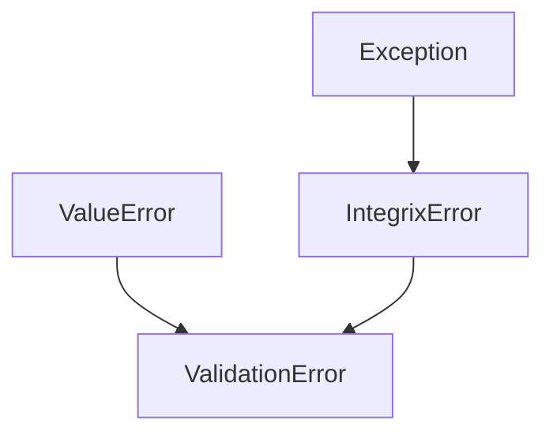

# Exceptions

Every error raised by the package derives from [`IntegrixError`][integrix.IntegrixError] *and* from the closest standard-library exception.

```mermaid
graph TD
    E[Exception] --> F[IntegrixError]
    V[ValueError] --> VE[ValidationError]
    F --> VE
```

::: integrix.exceptions
